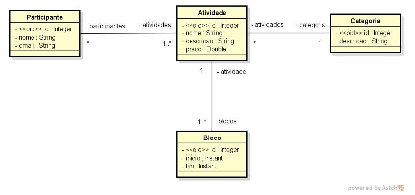
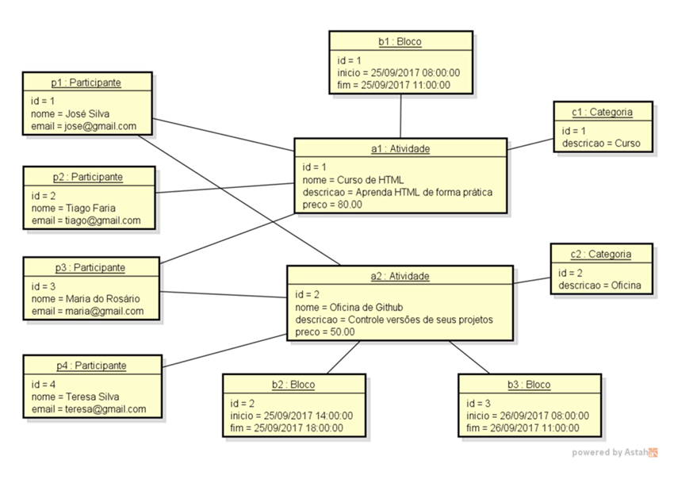

# Desafio avaliativo do curso de formação Spring Boot Profissional da DevSuperior ministrado pelo professor Nélio Alves.

## Capitulo: Modelo de domínio e ORM

O projeto deve utilizar Java com Spring boot e o banco de dados H2, o programador deve implementar o modelo conceitual conforme especificação a seguir. Além disso será necessário a implementação do Seeding da base de dados conforme o diagrama de objetos

## ESPECIFICAÇÃO - Sistema EVENTO

O sistema deve ser construido para gerenciar as informações dos participantes das atividades de um evento acadêmico. As atividaes deste evendo podem ser, por exemplo, palestrar, cursos, oficinas práticas, etc. Cada atividade que ocorre no evento 
possui um nome, descrição, preço e pode ser dividido em vários blocos de horários. Para cada participante, deve ter um cadastro com seu nome e e-mail.

# UML do sistema de eventos

# Diagrama do seeding para o banco de dados

## Informações

Projeto avaliativo para o curso **Java Spring Professional** da **DevSuperior**, ministrado pelo Prof. Dr. **Nélio Alves**, que visa trabalhar:

* **Implementação de entidades de domínio**
* **Mapeamento objeto-relacional com JPA**
* **Setup de projeto Spring Boot para banco H2**
* **Seeding de base de dados H2**

## Desenvolvedor

**Juliano Martins de Souza**

**LinkedIn:** https://www.linkedin.com/in/julianomarthins/
